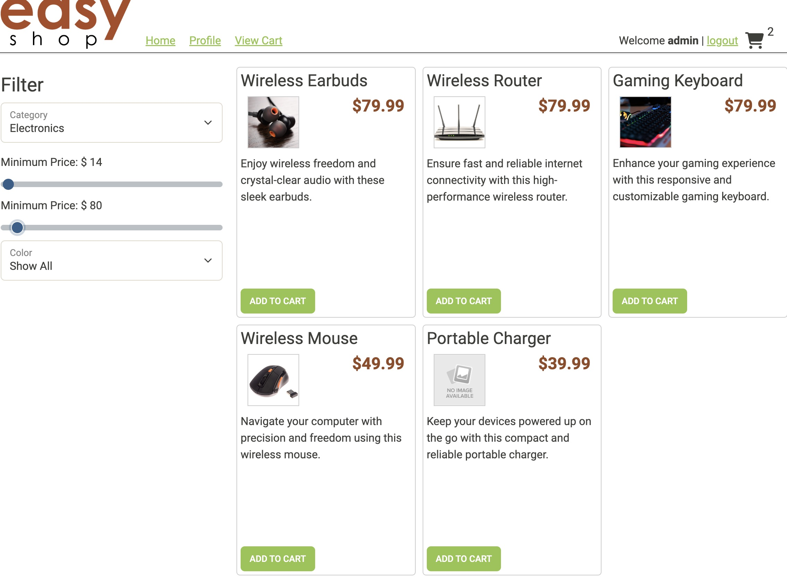
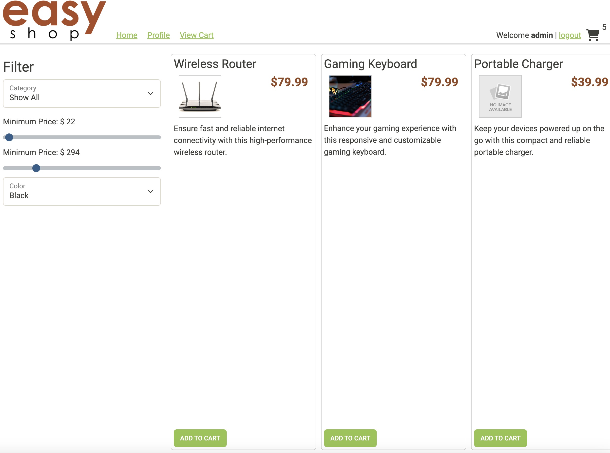
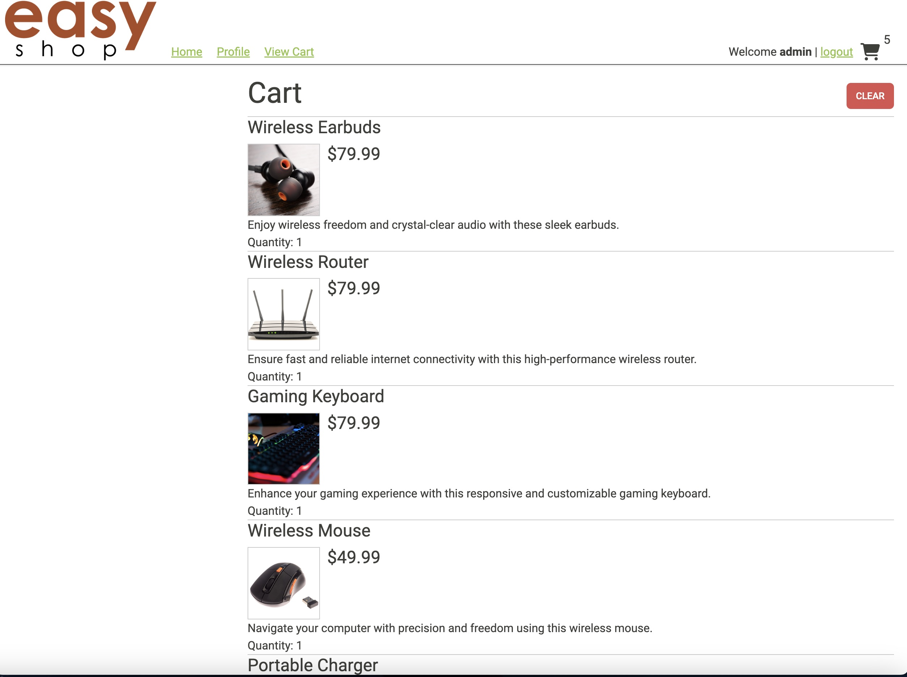
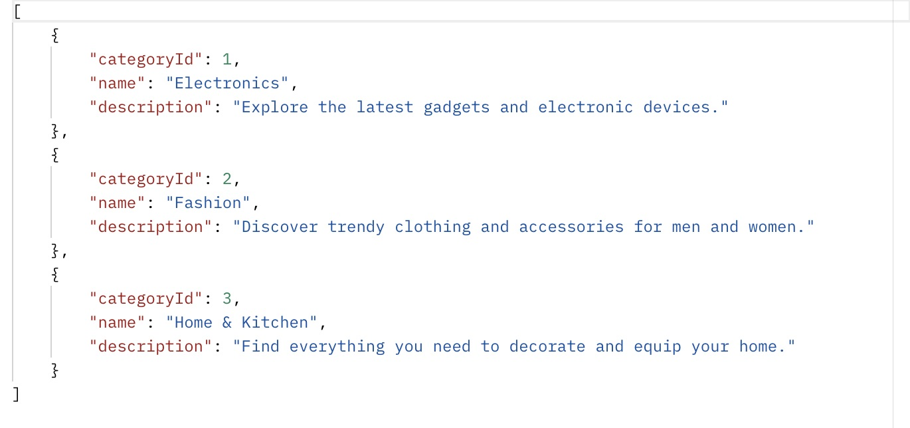
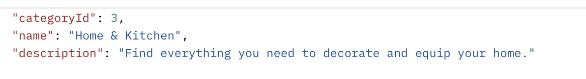
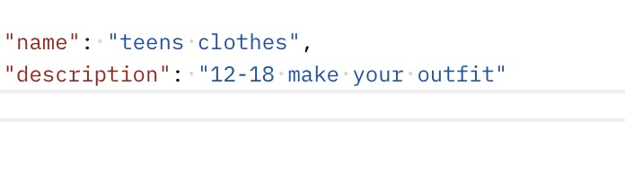
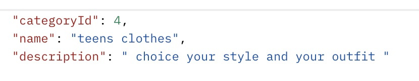

# EasyShop

Welcome to EasyShop is an online store. EasyShop sells electronics, clothing, home and Kitchen supplies. EasyShop provides user to instantly order from home and have it deliever for free. 

In the EasyShop website I used the Spring Boot Apo for the backend server. Along with using MySQL database for data storage. TO test my application post,put and delete I used Postman to test my application and logic. 

In this project I learn how to implement code with existing frontend implementation and being able to debug. 

## Demo

- The user is able to find a product in their price range such as Minimum Price $14 - Maximum Price $80 in the electronic department. 



- We are also able to find products by color and price range. 



- We are also able to add products to our cart.



- Get All categories 



- get category by id in postman



- Add a category 



- Update Category 




## Code

- While working on my project, I faced a challenge in updating the quantity of a user's product to their desired amount. My problem was that the product quantity would never update whenever I attempted to do so. Initially, I believed that I only needed the productId and the Principal to update the quantity as desired. However, it did not work as expected. When I sought help to understand why the quantity was not updating, I realized that I was missing the parameter for the ShoppingCartItem in my request body.

From this I was able to learn that when updating you always include the body of what is being update as in this case was the shoppingcartItem item meaning one single item to do this we need to @RequestBody.
```
{
 @PutMapping("/products/{productId}")
    public void updateProductQuanityInCart(@PathVariable int productId,  Principal principal, @RequestBody ShoppingCartItem cartItem)
    {
        try{
            String userName = principal.getName();
            User user = userDao.getByUserName(userName);
            int userId = user.getId();

            shoppingCartDao.updateProductQuantityInsideCart(productId, userId, cartItem.getQuantity());
        } catch(Exception e)
        {
            throw new ResponseStatusException(HttpStatus.INTERNAL_SERVER_ERROR, "Oops... our bad.");
        }


    }
}
```

- Another interesting piece of code involves updating the quantity in the database and instantly reflecting the change. To achieve this, I needed to update where the productId and user_id were located. 

```
{
@Override
    public void updateProductQuantityInsideCart(int productId, int usedId, int quantity)
    {
        try (Connection connection = getConnection())
        {
            String sql = """
                    UPDATE shopping_cart
                    SET quantity = ?
                    WHERE product_id = ? AND user_id = ? ;
                    """;
            PreparedStatement statement = connection.prepareStatement(sql);
            statement.setInt(1,quantity);
            statement.setInt(2,productId);
            statement.setInt(3,usedId);

            statement.executeUpdate();

        } catch (SQLException e) {

        }
    }
}
```
- 

